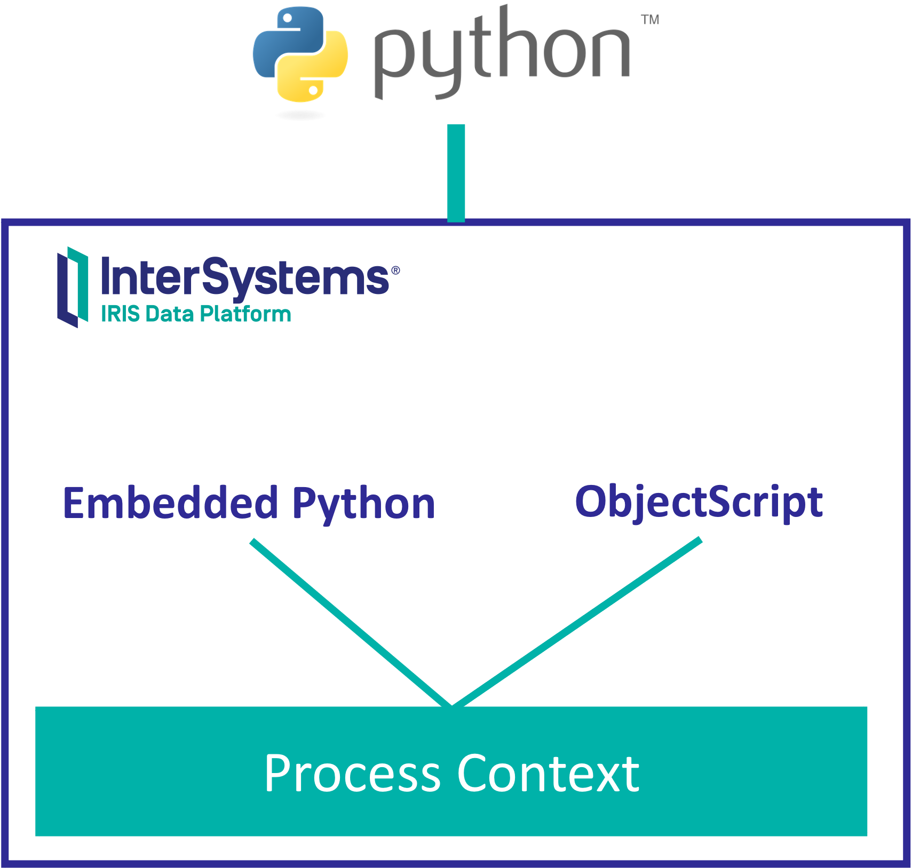

Intro to using Embedded Python in InterSystems IRIS. You can find more information in [Embedded Python QuickStart](https://learning.intersystems.com/course/view.php?id=1824&ssoPass=1) and [Using Embedded Python](https://docs.intersystems.com/irisforhealth20212/csp/docbook/DocBook.UI.Page.cls?KEY=AEPYTHON)



# Setup
Run the container we will use as our InterSystems IRIS instance:
```
docker-compose up -d
```

You can log in the [Management Portal](http://localhost:52773/csp/sys/UtilHome.csp) using `superuser/SYS`

Now you can explore different ways to execute Embedded Python in InterSystems IRIS:

# (a). From the Python Shell
Open a Terminal session in IRIS or simply open [WebTerminal](http://localhost:52773/terminal/)
```
docker exec -it iris-python bash
iris session iris
```

## (a.1) Run a class method
```
USER>zn "WORKSHOP"
WORKSHOP>do ##class(%SYS.Python).Shell()

Python 3.8.10 (default, Sep 28 2021, 16:10:42) 
[GCC 9.3.0] on linuxType quit() or Ctrl-D to exit this shell.
>>> print('Hellow world!')
Hellow world!
>>> irisVersion = iris.cls('%SYSTEM.Version').GetVersion()
>>> print(irisVersion)
IRIS for UNIX (Ubuntu Server LTS for x86-64 Containers) 2021.2 (Build 617U) Thu Dec 9 2021 15:00:18 UTC
>>> 
```

## (a.2). Open a object and display some property
Have a look at [Workshop/Data/Person.cls](src/Workshop/Data/Person.cls) and then type the following in the Python shell:

```python
>>> person = iris.cls('Workshop.Data.Person')._OpenId(1)
>>> vars(person)
{'%%OID': '\x04\x0119\x16\x01Workshop.Data.Person', '%Concurrency': 1, 'LastName': 'Jackson', 'HomeAddress': <iris.Workshop.Data.Address object at 0x7f75d3223e70>, 'FirstName': 'Phil', 'DOB': 39069}
>>> print(person.FirstName)
Phil
>>> person.SayMyName()
Hi, my name is Phil Jackson
```

# (b). From a Python script file
* Check out [test.py](python/test.py)
* Open a shell session with the IRIS container:
```
docker exec -it iris-python bash
```
* Run [test.py](python/test.py) Python script:
```
cd /usr/irissys/bin/
export IRISNAMESPACE=WORKSHOP
./irispython /app/python/test.py
Fibonacci series:
0 1 1 2 3 5 8 
InterSystems IRIS version:
IRIS for UNIX (Ubuntu Server LTS for x86-64 Containers) 2021.2 (Build 617U) Thu Dec 9 2021 15:00:18 UTC
```

# (c). In a method in an InterSystems IRIS class
* Have a look at [EmbeddedPython.cls](src/Workshop/EmbeddedPython.cls)
* Also, check out the two methods of [Person.cls](src/Workshop/Data/Person.cls)
* You can call these methods both from ObjectScript or Python

```
WORKSHOP>set obj=##class(Workshop.Data.Person).%OpenId(1)

WORKSHOP>write obj.SayMyNamePython()
Hi, in Python my name is also Phil Jackson
```

```objectscript
WORKSHOP>do ##class(%SYS.Python).Shell()

Python 3.8.10 (default, Sep 28 2021, 16:10:42) 
[GCC 9.3.0] on linux
Type quit() or Ctrl-D to exit this shell.
>>> import iris
>>> status = iris.cls('Workshop.EmbeddedPython').Test()
Fibonacci series:
0 1 1 2 3 5 8 
InterSystems IRIS classes in this namespace:
Workshop.Data.Address
Workshop.Data.Person
Workshop.EmbeddedPython
Workshop.Installer
```

# (d). In SQL Functions and Store procedures
* Connect to IRIS instance container
```
docker exec -it iris-python bash
```
* Now install `python-dateutil` library using `pip3` command.
```
irisowner@0ba470d8897c:/opt/irisapp$ pip3 install --target /usr/irissys/mgr/python/ python-dateutil
```

* Create a function using SQL and Python
```sql
CREATE FUNCTION tzconvert(dt DATETIME, tzfrom VARCHAR, tzto VARCHAR)
    RETURNS DATETIME
    LANGUAGE PYTHON
{
    from datetime import datetime
    from dateutil import parser, tz
    d = parser.parse(dt)
    if (tzfrom is not None):
        tzf = tz.gettz(tzfrom)
        d = d.replace(tzinfo = tzf)
    return d.astimezone(tz.gettz(tzto)).strftime("%Y-%m-%d %H:%M:%S")
}
```

Now you can simply use it
```sql
SELECT tzconvert(now(), 'US/Eastern', 'UTC')
```

# (e). Calling embedded Python code from ObjectScript
* Let's install a Python library and then use it from ObjectScript.
* Connect to IRIS instance container
```
docker exec -it iris-python bash
```
* Now install `reportlab` library using `pip3` command.
```
irisowner@0ba470d8897c:/opt/irisapp$ pip3 install --target /usr/irissys/mgr/python/ reportlab
```
* The class [PDF.cls](src/Workshop/PDF.cls) has already a method that imports the installed library using `##class(%SYS.Python).Import()` and use it to create a PDF file.
```objectscript
do ##class(Workshop.PDF).CreateSamplePDF("/app/sample.pdf")
```

# (f). Calling a method written in Python
* Install another Pyton library, now it's for cleaning and formating us addresses.
* Connect to IRIS instance container
```
docker exec -it iris-python bash
```
* Install `usaddress-scourgify` library using `pip3` command.
```
irisowner@0ba470d8897c:/opt/irisapp$ pip3 install --target /usr/irissys/mgr/python/ usaddress-scourgify
```
* Class [Address.cls](src/Workshop/Data/Address.cls) has a method which uses `usaddress-scourgify` that is used to normalize an address and store it as an object
```objectscript
set address = ##class(Workshop.Data.Address).%New()
do address.Normalize("One Memorial Drive, 8th Floor, Cambridge, Massachusetts 02142")
zwrite address
address=7@Workshop.Data.Address  ; <OREF>
+----------------- general information ---------------
|      oref value: 7
|      class name: Workshop.Data.Address
| reference count: 2
+----------------- attribute values ------------------
|       AddressLine1 = "ONE MEMORIAL DR"
|       AddressLine2 = "FL 8TH"
|               City = "CAMBRIDGE"
|         PostalCode = "02142"
|              State = "MA"
+-----------------------------------------------------
```

# (g). Calling a method written in Python to create an Excel file from a query
* Install another Python library, now it's working with Excel files.
* Connect to IRIS instance container
```
docker exec -it iris-python bash
```
* Install some libraries using `pip3` command to work with Excel files and dataframes:
```
pip3 install --target /usr/irissys/mgr/python/ pandas openpyxl
```
* Class [Excel.cls](src/Workshop/Excel.cls) has a method which uses `openpyxl` that creates an Excel file from an IRIS SQL query.
```objectscript
do ##class(Workshop.Excel).Test()
```